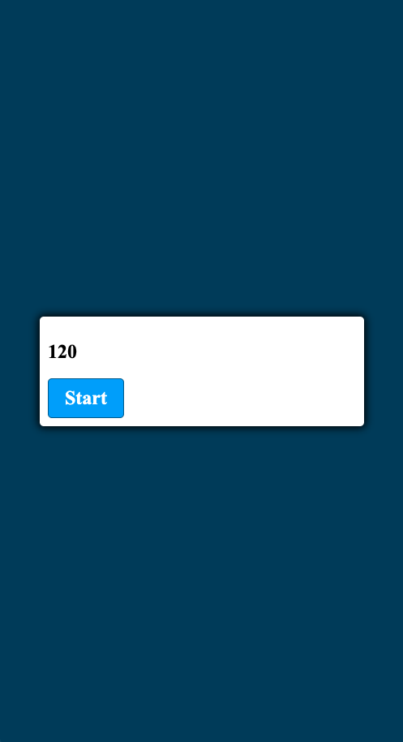

# Code Quiz

Welcome to the README for my fourth project as a student of Coding Boot Camp at UCLA Extension: The JavaScript Code Quiz.

## Description

My fourth project is a JavaScript code quiz: A timed quiz that stores high scores, starts on the start button, subtracts time when a wrong answer is given and is over when all questions are answered or time runs out.

## Link

[Code Quiz](https://seanc0ne.github.io/code-quiz/)

## Screenshot

